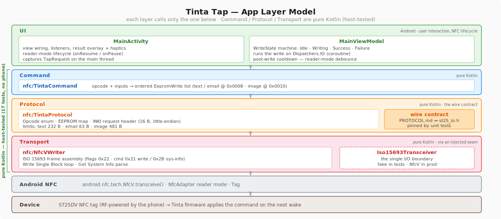

# Architecture

Tinta Tap is a single-screen Android app that writes short commands to a Tinta
device's ST25DV NFC tag over ISO 15693. It is deliberately layered so the
app ↔ firmware **wire contract** can be verified on the JVM, without a phone.

## Layers



Dependencies point downward only. The Protocol, Command, and Transport layers
have **no Android imports** — the single Android call (`NfcV.transceive`) is
injected through the `Iso15693Transceiver` seam, created in `MainViewModel`.

## Anatomy of a tap

1. Android delivers a `Tag` (reader mode, or a `TECH_DISCOVERED` intent).
2. `MainActivity.handleTag` captures the current UI inputs on the main thread
   (selected opcode, and text / email / drawn image) into a `TapRequest`.
3. `MainViewModel.onTag` gates the tap (busy? within cooldown?), moves to state
   `Writing`, and runs the write on `Dispatchers.IO`.
4. `performWrite` connects, reads the tag geometry (`getSystemInfo`), writes any
   payload segments from `TintaCommands.dataWrites`, then the 16-byte request
   header from `TintaProtocol.buildRequestHeader` at the tag tail.
5. The outcome becomes `WriteState.Success` / `Failure`; the Activity shows the
   overlay + haptic and returns the machine to `Idle`.

## The reader-mode cooldown

After a successful write, reader mode immediately re-discovers the same tag. A
re-fire would carry a fresh nonce that the firmware cannot de-duplicate, so the
client debounces for a few seconds. This guard lives in one place: `MainViewModel`.

## Testing

| Unit | Runs on JVM (no device)? | How |
|------|--------------------------|-----|
| `TintaProtocol` | yes | `TintaProtocolTest` — header bytes, opcodes, EEPROM map, framing |
| `TintaCommand`  | yes | `TintaCommandTest` — per-opcode EEPROM writes, truncation |
| `NfcVWriter`    | yes | `NfcVWriterTest` — frame assembly + Get System Info parsing, via a fake `Iso15693Transceiver` |
| `MainViewModel` | device / Robolectric | uses `Tag` / `NfcV` |
| `DrawingCanvasView` | device / Robolectric | it is a `View` (its pixel logic could be extracted) |
| `MainActivity`  | device (Espresso) | UI |

Run the host tests with:

```
./gradlew testDebugUnitTest
```

The wire format itself is specified in [PROTOCOL.md](PROTOCOL.md); these tests
pin the Kotlin side to it, so app and firmware cannot silently drift.
